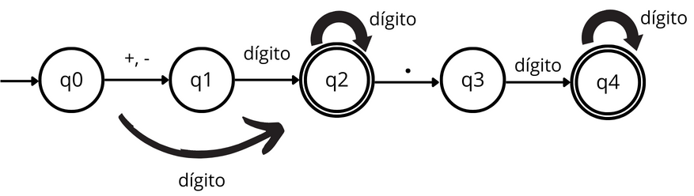
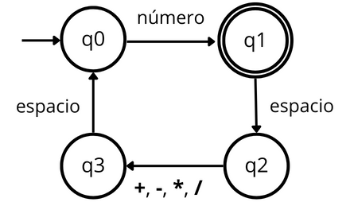
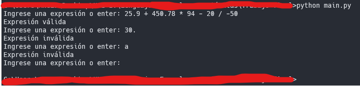

# Analizador léxico simple

---

1. [Introducción](#introducción)
1. [Instalación](#instalacion)
1. [Requisitos del sistema](#requisitos-de-sistema)
1. [Uso del programa](#uso-del-programa)
   - [Interfaz de usuario](#interfaz-de-usuario)
   - [Ejemplo de Uso](#ejemplo-de-uso)
   - [Testing](#testing)
1. [Soporte técnico](#soporte-técnico)
1. [Tiempo de respuesta](#tiempo-de-respuesta)
1. [Contribuidores](#contribuidores)

---

## Introducción

Los analizadores léxicos desempeñan un papel fundamental en el campo de la compilación de programas; son el primer paso para la interpretación y procesamiento del código fuente. Estos componentes, también conocidos como escáneres léxicos, descomponen el código en unidades léxicas significativas, proporcionando así una base esencial para los siguientes pasos en el proceso de compilación. La importancia de los analizadores léxicos radica en su capacidad para transformar un flujo continuo de caracteres en una serie estructurada de tokens, facilitando así la comprensión y manipulación del código por parte de los compiladores.

En este caso usamos 2 Analizadores Lexicos. El primero, analiza un número ya sea positivo, negativo, entero y/o decimal. Y el segundo, hace uso del primero para analizar la cadena completa.





## Instalacion

1. Clona el repositorio:

   ```bash
   git clone https://github.com/angelchavezinformatica/analizador_lexico_simple.git
   cd analizador_lexico_simple
   ```

## Requisitos de Sistema

- Python 3.9 o superiores.

## Uso del Programa

### Interfaz de usuario

- Ejecutando el siguiente comando en el directorio del programa puede empezar a usar el programa.

  ```bash
  python main.py
  ```

### Ejemplo de Uso



### Testing

- Ejecutando el siguiente comando puede testear el programa.

  ```bash
  python test.py
  ```

## Soporte Técnico

### Plataforma de Soporte

- Correo Electrónico: achavezg@unitru.edu.pe

## Tiempo de Respuesta

Haremos todo lo posible para responder a tus consultas en un plazo de 48 horas.

¡Gracias por utilizar nuestro Analizador léxico simple!

### Contribuidores

- Chávez García Angel Emanuel
- Mostacero Bazan Kevin Alejandro
- Sánchez Abanto Félix Aladino
